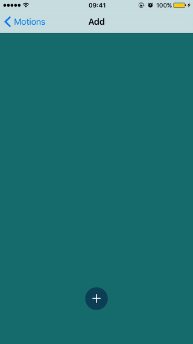
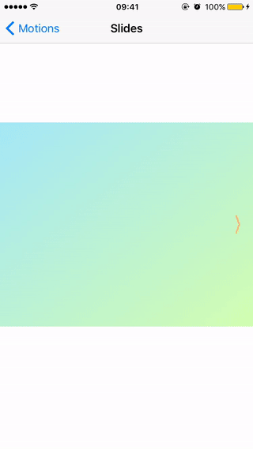

# MotionExperiment
An animation group inspired by [Michael Villar](http://www.michaelvillar.com/motion)

### NOTE
This is **NOT** an official copy ,all the timing functions & paths are from wild guess :) .

### To dos

08.Photo Loading (You can actually find a tutorial at raywenderlich [here](https://www.raywenderlich.com/94302/implement-circular-image-loader-animation-cashapelayer))

09.Logo(I don't think im gonna finish this)

<del>11.LCD</del>

12.New Tweet(Quite easy , not going to do this)

<del>13.Syncing/Success Icon</del>

14.Counter (I can't seem to achieve this)

15.Safari Link (I'll try ,no gurarantees)

<del>16.Navigation Menu</del>

17.Play/Pause icon

18.Tap

### Previews

#### Spinner

#### Add

#### Slides

For more detail ,plz download the project.
Feel free to start a PR or an issue for any better implementations or problems.
